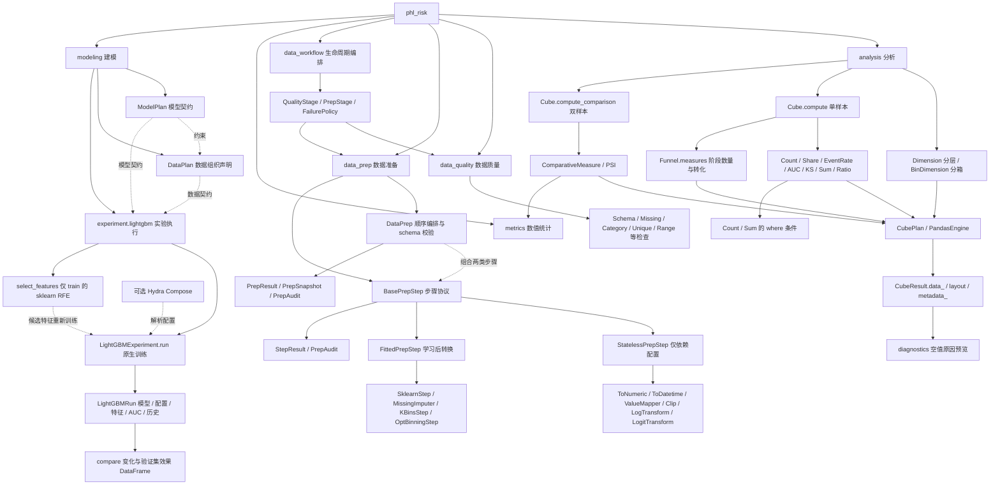
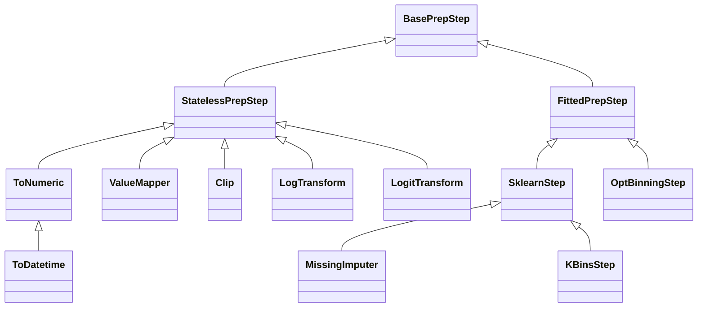

# phl-risk

面向数据分析、模型评估、数据生命周期管理与建模实验的通用 Python 框架。
从数据检查、清洗转换到分层指标、漏斗转化、双样本分布比较和 LightGBM 二分类实验，
使用可组合的声明描述任务，并在独立执行层保存可追踪的结果。

## 功能结构与入口



| 能力 | 主要对象与调用 | 结果 / 用途 |
|---|---|---|
| 建模声明 | `ModelPlan` + `DataPlan.validate_against(model_plan)` | Goal/Strategy/objective 解析、角色/特征/分区声明；不训练、不切分，见 [Plan Layer](docs/modeling_plan.md) |
| 二分类实验 | `LightGBMExperiment.run(...)` | 原生 LightGBM 训练，每次生成独立不可覆盖的 Run |
| 实验比较 | `exp.compare()` / `exp.set_reference(...)` | 参数/特征变化、train/valid AUC、gap 和相对 reference 的 delta |
| 特征候选 | `exp.select_features(...)` | sklearn RFE 仅使用 train；候选重新进行原生训练 |
| 可选配置合成 | `compose_lightgbm_config(...)` | Hydra 解析后的 dict 与 overrides；核心支持普通 dict |
| 实验恢复 | 重建 `LightGBMExperiment(...)` / `LightGBMRun.load(path)` | 校验契约与 artifact，按需获取原生 Booster |
| 分层指标、双分数交叉 | `Cube.compute(df)` / `fit_compute(df)` | CubeResult，布局、单样本总计 |
| 条件统计 | `Count(where=...)` / `Sum(column, where=...)` | 类别、数值和组合条件，只影响当前指标 |
| 空值诊断预览 | `result.diagnostics()` | 原因码、字段、缺失数量及上游依赖；覆盖范围见下文 |
| 共享分数段 | `BinDimension("score_b", QuantileBinner(5), fit_field="score_a")` | 从 score_a 学习边界，再对 score_b 分箱 |
| 参考分箱 | `BinDimension` + `QuantileBinner`，`cube.fit(reference)` | 固定边界用于后续 compute |
| 漏斗 | `Funnel` / `Stage` / `Transition`，`funnel.measures()` | 数量与相邻/指定转化率 |
| 双样本 PSI | `PSI`，`cube.compute_comparison(reference, current)` | 两侧相同 N 维 key 的批量 PSI |
| 数据质量 | `DataQuality.fit(reference).validate(current)` | QualityReport 与 PASS/WARN/FAIL/SKIP |
| 无状态转换 | `StatelessPrepStep.transform(df)` / `run(df)` | 无须 fit；DataFrame / StepResult 与转换审计 |
| 学习型转换 | `FittedPrepStep.fit(reference).transform(current)` | 复用训练状态转换当前数据 |
| 混合步骤编排 | `DataPrep.fit(reference).run(current)` | 固定每步输出 schema；PrepResult 与转换审计 |
| 质量与转换编排 | `DataWorkflow.fit(reference).run(current)` | WorkflowResult 与阶段结果 |
| 保存、加载生命周期对象 | `obj.save(path)` / `Class.load(path)` | Python-native 版本化 artifact |
| 数值计算 | `auc_score` / `ks_score` / `event_rate` / `psi_from_proportions` | 无 Cube 依赖的数值结果 |

Dimension 决定分析粒度，Measure 决定指标，Engine 执行，Result 保存结果，Layout 只负责展示。
PSI 的分层、分箱和比较由 analysis 提供，唯一数学内核位于 metrics；两者构成同一条计算链路。
DataQuality 仅负责数据质量，不依赖 analysis 或 metrics。
GitHub 仓库名 **`phi_risk`**，Python 导入名 **`phl_risk`**，发行包名 **`phl-risk`**。

详细变更见 [CHANGELOG](CHANGELOG.md)，完整示例见 [示例导航](examples/README.md)。

系统学习 analysis 可直接打开 [analysis 完整 Jupyter 教程](examples/analysis_complete_guide.ipynb)：
20 章使用合成数据逐层展示分层指标、条件筛选、分箱交叉、总计、漏斗、PSI、空值诊断及扩展接口，
包含运行结果、图表、数学校验和常见错误说明。环境准备见 [教程运行说明](examples/README.md#analysis-完整-notebook)。

## 0.5.0 更新：LightGBM 实验执行层

当前源码版本为 0.5.0，尚未发布 PyPI 或 GitHub Release。modeling 包含两层：
Plan 声明契约，Experiment 真正执行训练。
默认使用 valid 早停和比较模型，test/OOT 保留给独立评估；旧 Run 不会被覆盖或重命名。
详见下方 [LightGBM 二分类实验](#lightgbm-二分类实验)和 [0.5.0 变更记录](CHANGELOG.md)。

## 0.4.0 更新与迁移

- 新增 modeling 声明层：模型目标、策略、角色、特征与分区的配置及联合校验；Plan 本身不执行训练或数据切分。
- DataPrep 区分 StatelessPrepStep 与 FittedPrepStep，新增 Clip、LogTransform、LogitTransform。
- BinDimension 支持 fit_field，两个字段可以使用相同参考字段学到的分箱边界。
- QuantileBinner.precision 默认六位小数，metadata/layout 使用相同标签；边界显示重合时自动提高精度。

升级注意：自定义有状态 Prep 改为继承 FittedPrepStep；旧 DataPrep artifact 需要重新 fit/save。
precision 现在表示小数位数，而非有效数字位数；区间标签文字会变化，实际分箱边界不变。
完整迁移说明见 [变更记录](CHANGELOG.md) 和 [数据准备生命周期](docs/data_prep_refactor.md)。

## 安装、环境与验证

当前源码版本为 **0.5.0**。Python ≥3.12；本次在 Python 3.12 验证。
依赖 NumPy ≥2.5、pandas ≥3.0、scikit-learn ≥1.9、joblib ≥1.6、SciPy ≥1.18，
版本上界见 `pyproject.toml`。OptBinning 0.21 为可选 `binning` extra，当前使用 Python 3.12。


从 GitHub 获取源码后安装：

```bash
git clone https://github.com/TaoXue-99/phi_risk.git
cd phi_risk
python -m pip install -e .
```

开发与验证使用 uv，在仓库根目录运行：

```bash
uv sync --group dev
uv run pytest -q -W error
uv run ruff check src/phl_risk tests examples benchmarks
uv run ruff format --check src/phl_risk tests examples benchmarks
uv run python examples/analysis_examples.py
uv run python examples/funnel_examples.py
uv run python examples/psi_examples.py
```

当前文档以源码安装为准，不依赖 PyPI 发布状态。
scikit-learn 是正式运行时依赖，负责 AUC/ROC 数值计算；框架保留输入策略与组合编排。

## LightGBM 二分类实验

`Plan` 只声明，`Experiment` 负责执行，`Run` 保存一次不可覆盖的训练结果。
核心是原生 `lightgbm.Dataset → lightgbm.train → lightgbm.Booster`；框架组织成熟工具，
辅助人工迭代，不实现 AutoML，也不自动宣布最佳模型。

### 安装与公共入口

从当前仓库安装可选依赖：

```bash
python -m pip install -e '.[lightgbm]'        # 普通 dict 配置即可训练
python -m pip install -e '.[lightgbm,hydra]'  # 额外使用 Hydra Compose
# macOS 的 LightGBM 还需要 OpenMP：brew install libomp
python examples/modeling/lightgbm_experiment.py --root ./experiments
```

LightGBM 要求 >=4.0,<5，Hydra 为可选配置层。
原有 `from phl_risk.modeling import ModelPlan, DataPlan` 仍不加载 LightGBM 或 Hydra。

| 导入路径 | 公共对象 | 职责 |
|---|---|---|
| `phl_risk.modeling` | `ModelPlan`、`DataPlan` | 模型与数据契约 |
| `phl_risk.modeling.goal` / `.strategy` | `BinaryClassification` / `LightGBM` | 学习目标与模型路线声明 |
| `phl_risk.modeling.plan` | `RoleSpec`、`FeatureSpec`、`SplitSpec`、`PartitionSpec`、splitter | 字段、特征与分区规则 |
| `phl_risk.modeling.experiment.lightgbm` | `LightGBMExperiment`、`LightGBMRun` | 实验执行、比较与结果恢复 |
| 同上 | `ResolvedConfig`、`compose_lightgbm_config` | 可选 Hydra 配置合成 |
| 同上 | `RFEResult` | 候选 Run、比较与 tolerance 建议 |

### 执行结构图

```mermaid
flowchart TD
    G[Goal 声明学习任务] --> MP[ModelPlan 解析兼容性]
    S[Strategy 声明模型路线] --> MP
    DP[DataPlan 声明 roles / features / split] --> EX[LightGBMExperiment]
    MP --> EX
    DATA[pandas DataFrame] --> EX
    DICT[普通 dict 配置] --> EX
    HY[可选 Hydra Compose] --> DICT
    EX --> SPLIT[Runtime 校验与 Column / Hash 分区]
    SPLIT --> TR[train 拟合数据]
    SPLIT --> VA[valid 早停与模型比较]
    SPLIT --> HO[test / OOT 独立评估]
    TR --> DS[DatasetBuilder 每轮新建 Dataset]
    VA --> DS
    DS --> FIT[Trainer 调用原生 lgb.train]
    FIT --> BO[Booster 与完整训练历史]
    TR -. 仅 train 执行 RFE .-> RFE[sklearn RFE 特征候选]
    RFE -. 通过 exp.run 重新训练 .-> EX
    BO --> EV[各分区 AUC / gap / importance]
    HO -. 仅训练后评估 .-> EV
    EV --> ST[ExperimentStore 原子落盘]
    ST --> RUN[LightGBMRun 独立不可变结果]
    RUN --> CMP[exp.compare 默认比较 train / valid]
    RUN --> MODEL[run.model 按需加载原生 Booster]
```

DatasetBuilder、Trainer、Store 是内部组件，用户主要操作 Experiment 和 Run。
模型/配置/特征/指标一同保存；同名 Run 生成新的唯一 ID，不覆盖历史结果。

### 数据用途与使用流程

| 分区 | 用途 | 默认 compare |
|---|---|---|
| train | 拟合模型、学习类别词表、RFE 删除特征 | 展示 train_auc |
| valid | 早停、比较参数与候选特征 | 展示 valid_auc、auc_gap 和 delta |
| test | 方案固定后的独立留出评估 | 隐藏，使用 include_test=True 查看 |
| oot | 时间外泛化检验 | 隐藏，使用 include_oot=True 查看 |

默认 `validation_partition="valid"`，`auc_gap = train_auc - valid_auc`。
缺少 valid 时明确报错，不自动改用 test。若查看 test/OOT 后据此继续调参，它们也参与了模型选择，
不能继续作为未触碰的最终评估集。历史上显式将 test 用作 validation 的 Run 仍可读取，
但其 test 实际承担验证集职责，不是独立测试成绩。

以下假设已经准备好 `data`、`model_plan` 和含 valid 分区的 `data_plan`；
完整构造过程见 [可运行示例](examples/modeling/lightgbm_experiment.py)。

```python
from phl_risk.modeling.experiment.lightgbm import (
    LightGBMExperiment, LightGBMRun, compose_lightgbm_config,
)

exp = LightGBMExperiment(
    name="risk_demo", root="./experiments", data=data,
    model_plan=model_plan, data_plan=data_plan,
)
baseline_config = {
    "model": {"params": {"num_leaves": 7, "max_depth": 3, "num_threads": 2}},
    "train": {"num_boost_round": 300, "validation_partition": "valid"},
}
baseline = exp.run(name="baseline", config=baseline_config)
exp.set_reference(baseline.run_id)

# 假设至少有 12 个特征；RFE 只在 train 上拟合，候选均重新原生训练。
selection = exp.select_features(base_run=baseline.run_id, candidate_counts=[12, 8], step=0.25)
selected_features = selection.runs[0].features  # 人工选择候选
comparison = exp.compare()  # pandas.DataFrame，数值保持 float

# Hydra 仅负责解析配置；features 与参数分别指定。
cfg = compose_lightgbm_config(
    config_dir="examples/modeling/conf", config_name="baseline",
    overrides=["model.params.max_depth=2", "model.params.bagging_freq=3"],
)
run = exp.run(name="depth2_bag3", config=cfg.config, overrides=cfg.overrides,
              features=selected_features)
comparison = exp.compare(reference=baseline.run_id)
final_review = exp.compare(include_test=True, include_oot=True)
restored_run = LightGBMRun.load(run.path)
model = restored_run.model  # 原生 lightgbm.Booster
```

默认比较表突出 `feature_change`、`param_changes`、`delta_valid_auc`、`delta_auc_gap` 与
`best_iteration`；所有变化相对 reference，不是相邻一行。支持 `params="all"` 或指定参数列表。
RFE 的 tolerance helper 默认跟随验证分区，只返回建议，不改变最终模型。
推荐流程：合理 baseline → RFE 粗筛 → 固定候选特征手工调参 → compare → 特征微调 → 最终 test/OOT 验证。

### 结果结构与边界

```text
experiments/risk_demo/
├── experiment.json
├── reference.json                  # 显式设置 reference 后生成
└── runs/<UTC时间>_<UUID>_<名称>/
    ├── run.json                    # 状态、训练元数据和校验和
    ├── config.yaml                 # 实际解析后的 model/train 配置
    ├── overrides.yaml              # 本轮显式配置覆盖
    ├── features.json
    ├── metrics.json                # 各分区 AUC 与 train-valid gap
    ├── eval_history.json
    ├── feature_importance.csv
    └── model.txt                   # 原生 Booster 模型
```

不默认保存原始数据或预测；重新打开 Experiment 需提供相同 Plan 契约并 attach 数据，
单独加载 Run 无需原始数据。失败尝试记录 failed，不进入默认比较。
V1 只执行 LightGBM 0/1 二分类及 Column/Hash split；RFE 类别排序采用 train ordinal codes，
不自动重映射按特征位置绑定的约束。详细限制见[完整使用文档](docs/lightgbm_experiment.md)。

入口：[完整示例](examples/modeling/lightgbm_experiment.py) ·
[baseline YAML](examples/modeling/conf/baseline.yaml) ·
[使用与恢复](docs/lightgbm_experiment.md) · [验收记录](docs/lightgbm_experiment_review.md)。

## Data Quality

```python
import pandas as pd
from phl_risk.data_quality import DataQuality, SchemaCheck, MissingRateCheck

train = pd.DataFrame({"income": [100.0, 200.0, 300.0]})
oot = pd.DataFrame({"income": [100.0, None, None]})
quality = DataQuality([
    SchemaCheck(),
    MissingRateCheck(columns=["income"], fail_delta=0.2),
]).fit(train)
report = quality.validate(oot)
print(report.to_frame())
print(report.summary())
```

`fit()` 保存 reference，`validate()` 返回不可变报告，不更新 reference 或输入数据。
提供 Schema、行数、缺失率、伪缺失、复合唯一键、类别集合、基数、常量、数值可转换性、
有限值和范围共 11 类检查。状态为 `PASS / WARN / FAIL / SKIP`；数据不合格返回 FAIL，
配置错误或检查缺少必需列而无法执行时抛出异常。普通 FAIL 不会中断其他检查。

## Data Prep

```python
from phl_risk.data_prep import DataPrep, ToNumeric, MissingImputer

train = pd.DataFrame({"income": ["100", "200", None]})
oot = pd.DataFrame({"income": ["1000 PHP", "10000"]})
prep = DataPrep([
    ToNumeric(columns=["income"], errors="coerce"),
    MissingImputer(columns=["income"], strategy="median"),
]).fit(train)
result = prep.run(oot)
assert result.data.income.iloc[0] == 150  # 使用训练中位数
print(result.audit_frame())
```

`transform()` 只转换；`run()` 额外返回每步审计，数值解析失败会记录为新增缺失。
`fit()` 按顺序学习，每一步接收前一步的输出。`SklearnStep(RobustScaler(), columns=["income"])`
可直接接入 sklearn 及兼容 transformer；支持输出列名、稀疏 OneHotEncoder 和列扩展。
`ToDatetime`、`ValueMapper`、`KBinsStep` 同样可独立使用。

安装 `uv sync --extra binning` 后，监督分箱使用原生 OptBinning：

```python
from phl_risk.data_prep import OptBinningStep

# X_train 为特征表；y_train 为索引对齐且同时包含 0/1 的标签。
# step = OptBinningStep(columns=["income", "score"], metric="woe").fit(X_train, y_train)
# output = step.transform(X_oot)
# table = step.binning_table("income")
```

支持 `woe / event_rate / indices / bins`、分类变量、特殊值、逐变量参数、权重及 `n_jobs`。
算法委托给 `BinningProcess`，完整可运行示例见 [OptBinning 示例](examples/optbinning_prep.py)。

### Stateless 与 Fitted 步骤

当前步骤的继承关系如下；`DataPrep` 按配置顺序组合这些步骤。



```python
from phl_risk.data_prep import Clip, LogTransform, LogitTransform

probabilities = pd.DataFrame({"prob": [0.0, 0.5, 1.0, None]})
result = LogitTransform("prob", output_column="prob_logit").run(probabilities)
assert result.audit.kind == "stateless"  # 直接运行，无须 fit
```

`ToNumeric / ToDatetime / ValueMapper / Clip / LogTransform / LogitTransform` 继承
`StatelessPrepStep`，只依赖配置；`SklearnStep / MissingImputer / KBinsStep / OptBinningStep`
属于 `FittedPrepStep`，先学习 train 再转换。`DataPrep.fit/transform/run` 的用户接口保持不变，
内部顺序执行 stateless transform 与 fitted fit_transform，并固定每步的输出 schema。

详细迁移、文件清单和边界语义见 [data_prep 重构说明](docs/data_prep_refactor.md)，
完整混合步骤示例见 [data_prep_lifecycle.py](examples/data_prep_lifecycle.py)。

## Data Workflow

```python
from phl_risk.data_workflow import DataWorkflow, QualityStage, PrepStage

workflow = DataWorkflow([
    QualityStage("raw", DataQuality([SchemaCheck()])),
    PrepStage("features", prep),
    QualityStage("prepared", DataQuality([
        SchemaCheck(), MissingRateCheck(["income"], max_rate=0),
    ])),
]).fit(train)
result = workflow.run(oot)
print(result.summary())
print(result.quality_reports["prepared"].to_frame())
workflow.save("workflow.joblib")
loaded = DataWorkflow.load("workflow.joblib")  # 只加载可信来源的文件
pd.testing.assert_frame_equal(loaded.transform(oot), result.data)
```

Quality 和 Prep 可任意顺序组合。后置 Quality 的 reference 来自处理后的训练数据，
`transform/run` 不会重新 fit。质量关卡支持 `on_fail="raise" / "warn" / "continue"`；
默认 raise 的异常携带 `.report` 和 `.stage`。continue 不会替缺少字段的转换自动补列。

详细语义、插件协议、版本策略和限制见 [数据生命周期文档](docs/data_lifecycle.md)。
完整数据异常处理与持久化示例见 [data_workflow_risk.py](examples/data_workflow_risk.py)。

## 优先复用成熟库

| 计算 | 实现 |
|---|---|
| AUC（单独或与其他指标组合） | `sklearn.metrics.roc_auc_score` |
| KS | `sklearn.metrics.roc_curve(drop_intermediate=False)` + `np.max(abs(tpr-fpr))` |
| 参考分位数 / 当前分箱 | `np.quantile` / `np.searchsorted` + pandas 有序类别 |
| Count / Share / EventRate / Sum / Ratio | pandas 共享 groupby sum + NumPy 向量化比例 |
| 结果布局 | NumPy broadcast/transpose/reshape + pandas MultiIndex |

`phl_risk.metrics` 是薄适配层，统一缺失、权重、二元类别和 `on_invalid` 策略，
不维护自写的 ROC 排序、累计分布或 AUC 积分算法，也不调用 sklearn 私有 API。
测试验证三方库参数、边界、共享调用次数以及分析结果，不重新实现三方库本身。

AUC 和 KS 始终独立调用各自的 sklearn 公共函数，不因指标组合切换实现路径。
两者可能重复排序，以保持调用路径清晰；仅完全相同的指标节点（例如重命名的 AUC）复用结果。
使用 `python benchmarks/benchmark_ranking.py` 可分别测量两个适配函数的耗时。

## 双样本比较：PSI

```python
import pandas as pd
from phl_risk.analysis import Cube, PSI, QuantileBinner

reference = pd.DataFrame({"group": ["A"] * 4, "score": [0., 1., 2., 3.]})
current = pd.DataFrame({"group": ["A"] * 4, "score": [1., 2., 3., 4.]})
cube = Cube(["group"], [PSI(field="score", binner=QuantileBinner(2))])
result = cube.compute_comparison(reference, current)
result.layout()
```

PSI 使用 reference 学习的同一套边界，按两侧相同 Dimension key 比较，支持 N 维与批量字段。
类别 PSI 用 `binner=None`；缺失默认独立箱；仅一侧存在的组保留并默认返回 NaN。
`compute()` 和 `compute_comparison()` 不混用，不允许同一 Cube 混合单样本与比较指标。
日期是普通维度，跨月固定基准逐日比较需在外部循环选样。本期不支持比较总计或基准缓存。

详见 [比较分析 API、数学口径和扩展方式](docs/comparative_analysis.md)、
[可运行 PSI 示例](examples/psi_examples.py)、[性能实测](docs/comparison_review.md)。

## 分层指标分析

```python
import pandas as pd
from phl_risk.analysis import Cube, AUC, KS

# 合成演示数据；后续交叉与总计示例沿用 df/train/oot。
df = pd.DataFrame({
    "dt": ["2026-09-01"] * 4 + ["2026-09-02"] * 4,
    "dataset": ["train"] * 4 + ["oot"] * 4,
    "user_type": ["new"] * 8,
    "label": [0, 1, 0, 1] * 2,
    "score": [0.1, 0.8, 0.4, 0.6, 0.2, 0.9, 0.3, 0.7],
    "score_a": [0.1, 0.8, 0.4, 0.6, 0.2, 0.9, 0.3, 0.7],
    "score_b": [0.3, 0.7, 0.2, 0.9, 0.4, 0.8, 0.1, 0.6],
})
train = df[df["dataset"] == "train"]
oot = df[df["dataset"] == "oot"]

cube = Cube(
    dimensions=["dt", "user_type"],
    measures=[AUC(target="label", score="score"), KS(target="label", score="score")],
)
result = cube.compute(df)
print(cube.explain())
print(result.data_)       # dt, user_type, metric, value
print(result.shape)       # 每个维度轴的长度 + metric 轴的长度
table = result.layout(rows=["dt"], columns=["user_type", "metric"])
```

`dimensions=[]` 表示全局分析；`measures=None` 默认使用 `Count()`，显式空列表报错。
无状态维度无需 fit。Dimension 实现使用通用维度序列；单样本保留既有测试，比较分析新增 0–4 维验收。

## OOT 自身分箱与交叉分析

```python
from phl_risk.analysis import Cube, BinDimension, QuantileBinner, Count, Share, EventRate

cube = Cube(
    dimensions=[
        BinDimension("score_a", QuantileBinner(n_bins=5)),
        BinDimension("score_b", QuantileBinner(n_bins=5)),
    ],
    measures=[Count(), Share(denominator="all"), EventRate("label", name="event_rate")],
)
result = cube.fit_compute(oot)

# count 的 B1–B5，随后 share 的 B1–B5，随后 event_rate 的 B1–B5。
vertical = result.layout(rows=["metric", "score_a_bin"], columns=["score_b_bin"])
horizontal = result.layout(rows=["score_a_bin"], columns=["metric", "score_b_bin"])
```

两次 layout 不重新执行 Cube，也不修改 `result.data_`。
`fit_compute(oot)` 等价于 `fit(oot)` 后 `compute(oot)`，适用于只看 OOT 自身分箱表现，完全不需要 train。
两个分数分别等频分箱，交叉格的人数不保证相等；小样本可能存在空箱。

如果需要固定 train 边界与 OOT 对比，改用：

```python
cube.fit(train)
result = cube.compute(oot)
```

fit 只学习分箱边界，compute 不会自动重学边界。重新调用 fit 会替换已有边界。
使用参考边界时，OOT 每个箱的人数不保证相等。
参考边界可通过 `cube.dimensions_[0].transformer.bin_edges_` 或结果 metadata 查看。

## 整体指标、行列总计与区间展示

总计表示**合并原始样本后重新计算指标**，不是已有单元格的均值。
AUC、KS 不能从每日指标推导整体值；EventRate 也必须合并事件数与有效分母，不能平均各格比例。
因此显式启用预计算：

```python
cube = Cube(["dt", "dataset"], [AUC("score", "label"), KS("score", "label")])
result = cube.compute(df, totals=True)

# dt × dataset：底部增加每个 dataset 的整体 AUC/KS。
table = result.layout(
    rows=["dt"],
    columns=["metric", "dataset"],
    totals=["dt"],       # 指定要折叠并增加 Total 的维度
    total_label="总计",
)

# 等价地沿用先 layout 再 unstack 的写法：
table = result.layout(totals=["dt"], total_label="总计").unstack(level="dataset")
```

交叉分箱的每个 metric 块都可增加底部总计和右侧总计：

```python
cube = Cube(
    [BinDimension("score_a", QuantileBinner(5)), BinDimension("score_b", QuantileBinner(5))],
    [Count(), Share(), EventRate("label")],
)
result = cube.fit_compute(oot, totals=True)
vertical = result.layout(
    rows=["metric", "score_a_bin"],
    columns=["score_b_bin"],
    totals=True,             # 为所有分析维度添加总计；metric 轴不汇总
    total_label="总计",
    bin_labels="interval",  # 展示格式化区间，如 [-inf, 0.500000]、(0.500000, inf]
)
```

- 每个 metric 块按各箱 → 总计的顺序显示；右下角是该指标的整体值。
- Count 的整体值是总行数；非空总体的 Share 整体值是 1；EventRate 是整体事件比例。
- `totals=["score_a_bin"]` 只添加该维度的总计，`totals=True` 添加所有维度的总计。
- `bin_labels="interval"` 仅改变展示，canonical 数据、B1/B2 标签、轴域和 learned edges 不变。
  区间文字与分箱 metadata 共用标签，默认六位小数；相邻边界显示重合时自动增加位数。
- `result.total(over=["dt"])` 直接取出折叠 dt 后的预计算 CubeResult；
  `result.total(over=["dt", "dataset"])` 取出整体结果。
- 总计只使用通过 filters 和全部维度 missing policy 的同一批有效分析行，不让被排除行重新进入分母。
- 分箱转换和过滤只执行一次；总计复用已转换维度，并按额外分组粒度计算指标。
  两个维度会额外计算三个粒度，耗时高于普通 compute；总分组粒度上限为 64。
- `layout()` 不保留、不访问原始样本、不重新执行引擎。未启用 `compute(..., totals=True)` 时请求总计会明确报错。
- 默认 `totals=False`、`bin_labels="code"`，既有展示不变；`shape`、`data_` 不计入总计，
  总计保存在独立的预计算结果中；展示的 `max_cells` 检查包括新增总计。
- 总计标签与维度已有值冲突时会报错，可换用 `total_label=`。

## 两个字段共用参考分箱边界

`fit_field` 指定学习边界的原始输入列，默认 `None` 表示使用自身字段。
例如两个分数采用相同尺度时，可以统一使用 score_a 的分位点：

```python
cube = Cube(
    [
        BinDimension("score_a", QuantileBinner(n_bins=5)),
        BinDimension("score_b", QuantileBinner(n_bins=5), fit_field="score_a"),
    ],
    [Count(), Share()],
)
cube.fit(reference)  # 两个 Dimension 都读取 reference["score_a"]
result = cube.compute(current)  # 分别对 current 的 score_a、score_b 分箱
# 若在同一份数据上学习和分析：result = cube.fit_compute(current)
```

相同参考数据、学习字段及分箱配置才会产生相同边界；score_b 不保证等频。
fit_field 不引用其他 Dimension，不依赖维度顺序，也不会复用另一个 Dimension 的可变状态。
fit 只需要学习列；compute 只需要实际分箱列及指标/过滤所需列。
metadata 的 column、fit_field 和 explain 的 Source、Fit source 分别记录转换与学习来源。
可运行完整案例见 [共享分箱示例](examples/shared_bin_edges.py)。

## 指标内条件筛选

`Count(where=Col("category") == "A")` 统计指定类别行数；
`Sum("amount", where=Col("amount") > 10)` 对满足阈值的金额求和。
两者支持类别、数值、缺失条件和组合表达式，不影响其他指标。
条件计数统一使用 Count(where=...)。多指标请指定不同 name。

```python
from phl_risk.analysis import Col, Count, Cube, Sum

condition = Col("category").isin(["A", "B"]) & (Col("age") >= 18)
cube = Cube(
    dimensions=["dt"],
    measures=[
        Count(name="全部数量"),
        Count(where=condition, name="筛选数量"),
        Sum("amount", where=condition, name="筛选金额"),
    ],
)
result = cube.compute(df, totals=True)
result.layout(totals=True)
```

无匹配时 Count/Sum 返回 0；普通条件最终为未知时不匹配，选缺失需显式使用 isna()。
Sum 先筛选再处理缺失：被排除行不影响结果，匹配行的缺失继续遵循原有 missing 策略。
Cube 的 filters 影响全部指标及 fit 参考数据，指标内 where 仅影响当前指标。

**迁移**：已删除 CountWhere。原来的 `CountWhere(condition, name="数量")`
改为 `Count(where=condition, name="数量")`，导入也改为 Count；不保留兼容别名。
完整规则见 [条件统计](docs/conditional_measures.md)，可运行样例见
[conditional_measures.py](examples/conditional_measures.py)。

## 空值诊断（框架预览）

`result.diagnostics()` 返回维度与 metric 索引的原因表，不改变原有 NaN。
当前接入 Sum 缺失传播、Ratio/漏斗上游缺失和零分母；其他计算空值标记
`reason_not_recorded`，不包含 layout 补出的空组合。

```python
report = result.diagnostics()
missing_inputs = report.loc[report["reason"].eq("missing_propagated")]
pooled_report = result.total(over=["dt"]).diagnostics()
```

| 原因码 | 当前说明 |
|---|---|
| missing_propagated | Sum 匹配记录中有缺失，按原策略传播为 NaN |
| upstream_missing | Ratio/漏斗所依赖的指标为空 |
| zero_denominator | Ratio/漏斗分母为零 |
| reason_not_recorded | 实际计算为空，但尚未采集详细原因 |

报告以维度和 metric 为索引，提供 field、input_rows、affected_rows、dependency、message。
报告不修改原始数据或指标值；input_rows 为组内分析行数，affected_rows 为匹配记录中的缺失行数。
AUC/KS、EventRate、PSI 的详细原因仍待接入；空报告不代表 layout 没有补齐空组合。
完整原因码和覆盖限制见 [诊断框架说明](docs/analysis_diagnostics.md)，运行示例见
[analysis_diagnostics.py](examples/analysis_diagnostics.py)。

## 表格形式的 explain

```python
cube.explain()                     # Notebook 原生 DataFrame 表格
cube.explain(totals=True)          # 同时说明总计计算计划
print(cube.explain(format="text")) # 终端对齐文本表格，不截断字段
```

表格按 `Section / Item / Description` 展示维度、源字段、拟合状态和边界、指标输入、
引擎、共享聚合数量以及缺失/无效策略。explain 仅解释计划，不执行计算。
默认返回类型由旧版字符串改为 DataFrame；需要字符串时显式使用 `format="text"`。

## 动态漏斗：数量与转化率

```python
from phl_risk.analysis import Cube, Funnel, Transition

funnel_df = pd.DataFrame({
    "dt": ["2026-09-01", "2026-09-02"],
    "戳额": [100, 10], "有额": [60, 8], "发标": [30, 6], "提现": [15, 4],
})
funnel = Funnel(
    stages=["戳额", "有额", "发标", "提现"],
    rates="both",  # 相邻转化 + 从首阶段转化，自动去重
)
result = Cube(["dt"], funnel.measures()).compute(funnel_df, totals=True)
result.layout(totals=True, total_label="总计")
```

阶段列既可为逐行 0/1，也可为汇总数量，统一求和后计算转化率。阶段数不限；
也可指定 `rates=[Transition(before="戳额", after="提现")]`。
分箱时把维度换成 `BinDimension("score", QuantileBinner(5))`，继续使用 fit/compute。
`funnel.measures()` 只生成普通指标配置。总计使用合并数量之比，不平均已有率。

新增通用 `Sum`、`Count(where=...)`、`Ratio` 与 `Col`；支持 Stage 显式指定源列、条件和显示名。
Sum 默认传播缺失，按零统计需显式配置；漏斗假定阶段单位一致且后阶段来自前阶段。
详见 [完整漏斗 API 与边界语义](docs/funnel.md) 和 [可运行 demo](examples/funnel_examples.py)。

## 语义约定

| 项目 | V0.1 行为 |
|---|---|
| Count | 当前单元格的行数，不受 label/score 缺失或 Context 权重影响 |
| Sum / Count(where=...) | 源数值求和 / 条件命中行数；均不使用 Context 权重 |
| Ratio | 同一 Cube 中两个命名指标的聚合结果相除，支持依赖排序 |
| Share | 单元格行数 / 过滤及维度缺失处理后进入分析的总行数 |
| EventRate | 指定事件的有效 target 数 / 全部有效 target 数；支持非二元事件值及权重 |
| AUC / KS | target 为 0/1；高分预测 1；KS 取累计分布最大绝对差 |
| 指标名称 | `count`、`share`、`event_rate__label__1`、`auc__score`、`ks__score`；支持 `name=` |
| 重名 | 维度输出名和指标名分别检查唯一性；维度名 `metric`、`value` 保留 |
| 顺序 | 维度按声明，指标按声明，普通字段按有效数据首次出现，categorical 按类别顺序 |
| 输入 | 内置变换与计算不修改用户 DataFrame；使用位置编码，支持重复行索引 |
| 结果 | 稀疏 long data + 完整轴域；`shape` 表示逻辑轴域，不等于长表行数 |
| 空组合 | layout 补齐：Count/Sum=0；非空总体的 Share=0；EventRate/AUC/KS/Ratio=NaN |
| 空总体 | 全局 Count/Sum=0，其他指标 NaN；普通字段无轴值，参考分箱/声明类别仍保留 |

例如单元格有 10 人、总体 100 人、其中 3 人发生事件且 target 均有效：**Share=10%，EventRate=30%**。

```python
from phl_risk.analysis import AnalysisContext, ComputePolicy, MissingPolicy

weighted_df = df.assign(sample_weight=1.0)
context = AnalysisContext(target="label", weight="sample_weight")
cube = Cube(
    dimensions=["dt"],
    measures=[AUC(score="score"), EventRate()],
    policy=ComputePolicy(missing=MissingPolicy(dimension="keep"), on_invalid="nan"),
)
result = cube.compute(weighted_df, context=context)
```

Measure 显式 target/weight 覆盖 Context；`None` 表示继承默认值。
权重用于 AUC、KS、EventRate，必须有限、非负；Count/Share 始终是行数语义。
默认维度缺失删除，可设置 `dimension="keep"`，缺失坐标在 AxisSpec 中表示为 `None`。
target 缺失按指标删除；score 缺失及非有限值只从 AUC/KS 删除，不影响其他指标。
单类别、零有效权重或零分母默认 NaN；可选择 `on_invalid="warn"` 或 `"raise"`。
无效配置、缺字段、非法权重始终报错，不被 `on_invalid` 吞掉。
结构性空箱不会触发无效组警告，layout 使用明确的空单元格值。

## 分箱细节

- `fit()` 只使用 reference 中的有限数值，全部无效时报错。
- `duplicates="drop"` 合并重复分位点；常量列产生 1 箱。`duplicates="raise"` 严格报错。
- 两端扩展为 `-inf`、`+inf`，current 越界及无穷进入两端箱，missing 仍为 missing。
- 右闭区间；`include_lowest=True` 包含 `-inf`，设为 False 时仅该最低端点视为缺失。
- 默认标签为有序 `B1…Bk`，实际箱数保存在 `n_bins_`，自定义 labels 长度必须匹配实际箱数。
- `precision` 控制 metadata 和 layout 区间标签的小数位数，默认 6；例如
  `QuantileBinner(5, precision=2)` 显示两位小数。相邻边界舍入后重合时自动增加位数，
  因此它不是严格的位数上限。标签是近似展示；精确边界请读取 `bin_edges_`，实际分箱判定不变。
- 构造器参数不可变；拟合字段以 `_` 结尾暴露；`bin_edges_` 返回防御性副本。

## 过滤、计划与扩展

```python
cube = Cube(["dt"], [Count(), Share()], filters=[lambda frame: frame["score"] >= 0.3])
plan = cube.plan()
print(cube.explain())
result = cube.compute(df, engine="pandas")
```

filters 顺序应用，fit reference 和 compute current 使用相同过滤规则；布尔掩码必须对齐索引，缺失掩码视为 False。
callable 是 pandas 临时入口；`FilterExpression` 提供 `required_columns()` 和 `evaluate(data, backend=...)` 扩展协议。
过滤函数应为纯函数；内置引擎隔离常规 DataFrame 赋值，不保证递归复制 object 单元格里的可变对象。

`CubePlan` 编译指标依赖并合并重复聚合节点。Engine 共用一次 native groupby aggregation，再执行组指标和派生比例。
AUC/KS 共用分组索引和原始字段数组，但分别调用各自的数值函数。
`BaseDimension`、`BaseTransformer`、`BaseMeasure`、`BaseCubeEngine` 都有公共导出；节点细节是 V0.1 私有 API。

`TableLayout` 必须恰好放置所有轴；遗漏、重复或未知轴会报错，绝不隐式求均值。
默认最多物化 1,000,000 个单元格，可通过 `max_cells=` 显式调整。
`data_`、`metadata_` 和 Cube 的维度访问器返回防御性副本；不提供通用 `set_params`。

## 文档与边界

- [逐阶段设计、代码与测试说明](docs/implementation.md)
- [代码审查与验证记录](docs/review.md)
- [示例导航与 Notebook 使用](examples/README.md)
- [漏斗 API 与数据口径](docs/funnel.md)
- [版本变更与迁移说明](CHANGELOG.md)
- [LightGBM 实验执行、比较与恢复](docs/lightgbm_experiment.md)
- [LightGBM 验收与边界说明](docs/lightgbm_experiment_review.md)

V0.1 不实现其他 backend、任务并行、Pipeline、SQL AST、任意公式求值（已支持 Ratio 命名依赖排序）、Excel/绘图/格式化系统或通用 select/sort API。
Result 的 pandas 容器是显式边界；未来引擎可以适配相同结果契约。
浮点统计不保证任意精度；极端权重比例小于浮点最小可表示范围时可能舍入为零。
