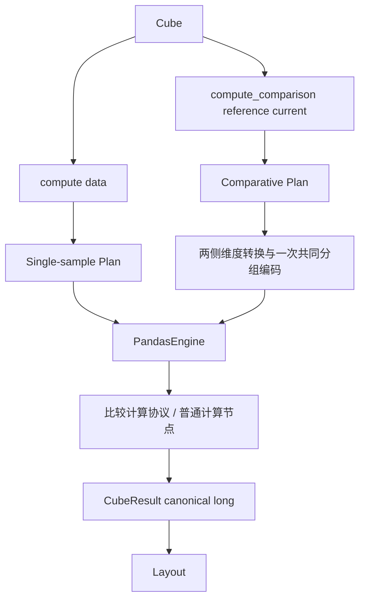

# Comparative analysis 与 PSI

`Cube.compute(data)` 是单样本计算；`Cube.compute_comparison(reference, current)` 是双样本比较。
二者共享 Dimension、Plan、Engine、CubeResult 和 Layout。PSI 是首个正式比较指标，
不另设 PSIAnalysis、PSIEngine 或 PSIResult。Python 3.12 为本次验收环境。

## 架构与输入



Dimension 始终表示分析粒度。两侧按所有 Dimension 的相同 joint key 匹配。
无维度比较整体，有 N 个维度比较 N 维联合分层；实现不区分 1D/2D 特例。
日期没有特殊意义，Cube 不负责选择基准期、窗口或时间偏移。

```python
import pandas as pd
from phl_risk.analysis import Cube, PSI, QuantileBinner

reference = pd.DataFrame({"segment": ["A"] * 4, "score": [0., 1., 2., 3.]})
current = pd.DataFrame({"segment": ["A"] * 4, "score": [1., 2., 3., 4.]})
cube = Cube(
    dimensions=["segment"],
    measures=[PSI(field="score", binner=QuantileBinner(n_bins=2))],
)
result = cube.compute_comparison(reference=reference, current=current)
print(result.layout(rows=["segment"], columns=["metric"]))
# canonical: segment, metric='psi__score', value
```

`dimensions=[]` 可计算整体。批量字段使用普通 Measure 列表：

```python
fields = ["score"]  # 可替换成实际 100 个字段名
cube = Cube(["segment"], [PSI(field=field) for field in fields])
result = cube.compute_comparison(reference, current)
```

默认名称 `psi__字段名`，`name=` 可覆盖，重复名称明确报错。
一个 Cube 不允许混合单样本和比较指标；错误入口也会拒绝执行。
现有直接继承 BaseMeasure 的插件默认为单样本，新插件可显式继承 SingleSampleMeasure。

## 日期分层与固定基准

`dimensions=["dt", "segment"]` 表示 **reference[dt, segment] 对比 current[dt, segment]**。
若两侧日期不重合，结果是单侧缺组的 NaN，不能隐式把基准整月广播给每日。
固定基准对比多个当前日期，使用外部循环；此时 Cube 的维度不包含日期：

```python
current = current.assign(dt="2026-09-01")
cube = Cube(["segment"], [PSI("score")])
daily = pd.concat([
    cube.compute_comparison(reference, frame).data_.assign(dt=dt)
    for dt, frame in current.groupby("dt", sort=False)
], ignore_index=True)
```

本期不引入 match_by、reference_dimensions、by、rolling 或时间窗口 DSL。

## PSI 参数与分箱生命周期

| 参数 | 默认 | 语义 |
|---|---|---|
| field | 必填 | 一个源字段，不限定为模型 score |
| binner | 新建 QuantileBinner(10) | 参考数值分箱；None 显式走类别路径 |
| epsilon | 1e-8 | 占比下限；截断后逐分布重新归一化 |
| name | psi__field | 指标名称 |
| missing | bucket | 独立缺失箱；drop 则各侧按字段删除缺失 |
| min_samples | 1 | 各侧每组最低有效数量；不满足按 on_invalid 处理 |

每次 compute_comparison 都复制 Measure 内的 binner，在通过 filters 和 Dimension 缺失规则的
**全部 reference 行**上学习一次，再对 reference/current 使用同一边界。
不在各组分别拟合，不用 current 学习边界，也不保留跨调用缓存。传入的已拟合 binner 也会在私有副本上重新 fit。

QuantileBinner 遇到 ties 可合并边界；常量参考形成一个数值箱，因此无法检测常量到另一个常量的数值位移。
超出参考范围的 current 值和正负无穷进入两端箱；默认边界延伸到正负无穷。
`include_lowest=False` 会把 -inf 判为缺失，继而遵循 missing 策略。

**Dimension 的生命周期不变**：若 dimensions 中含 BinDimension，仍需先 `cube.fit(reference)`。
PSI 内部的 binner 不要求 Cube.fit，也不修改 `cube.dimensions_`。
自定义 binner 必须返回保序、保索引、同一类别域的 categorical Series；监督式拟合不属于此接口。

## 类别与缺失

```python
categories_ref = pd.DataFrame({"channel": ["A", "B", "C", None]})
categories_cur = pd.DataFrame({"channel": ["A", "C", "D", None]})
result = Cube(measures=[PSI("channel", binner=None)]).compute_comparison(
    categories_ref, categories_cur,
)
```

类别域取两侧并集，保留 reference 首次出现顺序，再加 current 新类别；声明的 categorical
未使用类别也保留。缺箱计数补 0。缺失使用独立整数编码，不会与真实字符串 `__MISSING__` 冲突。
数值默认不会自动切换到类别模式；非数值字段应显式传 `binner=None`。

| 边界情况 | 处理 |
|---|---|
| Dimension 缺失 | 默认 drop；ComputePolicy(missing=MissingPolicy(dimension="keep")) 保留为 None key |
| 仅一侧存在某组 | group 并集保留；默认 NaN，可 warn/raise |
| 两侧都没有的类别组合 | 不生成稀疏记录；Layout 补 NaN |
| PSI 字段缺失 | 默认独立箱，缺失率漂移参与 PSI；drop 时不计入该字段分母 |
| reference 整体为空或没有有限数值 | 无法学习 Quantile 边界，默认 NaN，可 warn/raise；不使用 current 补学 |
| 某组全缺失、但全局参考有可用边界 | bucket 可参与计算；drop 下该组有效数量为 0 |
| 类别型两侧全缺失 | bucket 下 PSI=0；drop 下无有效样本，按无效策略处理 |
| current 为空 | 对应参考组仍保留，PSI 无定义 |
| 两侧全空且无维度 | 一个全局 NaN；有维度则没有观测 key |
| 权重 | 本期 PSI 仅行计数，显式传 context.weight 会报错 |

PSI 描述分布变化，不直接代表模型区分能力下降；框架不内置固定业务阈值。

## 数值口径与兼容性

`phl_risk.metrics.psi_from_proportions(reference_pct, current_pct, epsilon=1e-8, on_invalid="nan")`
只接收 NumPy 可转换的数值，不认识 DataFrame、field、Dimension 或 Cube。

- 转为 float64，要求相同 shape，支持 `(bins,)` 和 `(groups, bins)`，沿最后轴归约。
- 输入每行需为有限非负占比且和约为 1；错误 shape/epsilon 始终报错，非法分布按行处理 invalid policy。
- 先分别执行 `p'=max(p, epsilon)`、`q'=max(q, epsilon)`，再各自除以行和。
- 计算 `sum((q'-p') * (log(q')-log(p')))`；使用对数差避免先做比值溢出。
- 不修改输入。1D 返回 float，2D 返回一维数组。两侧都为零的空箱贡献为零，但归一化可能微调其他箱占比。

0.3.0 删除旧计数 PSI 函数及 DataQuality 内的独立分箱/类别算法。
统一使用 `PSI → Cube.compute_comparison → psi_from_proportions`，默认 epsilon=1e-8。
已经持有计数数组的调用方先按各自总数转为占比，再使用占比内核；零总体按无效输入处理。

DataQuality 不再提供 DistributionDriftCheck，也不调用比较框架。
需要 PSI 时直接使用 analysis 的 Cube；质量检查和分布比较由调用方独立编排。
旧的含漂移检查的质量对象/工作流 artifact 不能继续使用，需移除该检查后重新 fit 和保存。
类别 PSI 使用两侧并集；常量数值参考使用 QuantileBinner 的单箱行为。

## 执行与结果边界

两侧维度各转换一次，构建共同轴域，再对 joint key 做一次 factorize。
每个字段分别拟合与编码 bin，用 `group_code * n_bins + bin_code` 和 `np.bincount`
得到两侧 group × bin 矩阵，再向量计算 PSI。100 字段共享分组信息，不逐字段 groupby。

只有本次使用的字段逐个生成工作数组，不一次构建 rows × fields × groups 张量。
单个 profile 最多 10,000,000 个单元，超限报 EngineError；两个 count 矩阵、比例和运算临时数组
仍可能占用数百 MB。高基数类别需先准备数据或减少粒度。

仍然返回 CubeResult；data_、layout、轴顺序和 max_cells 规则不变，metadata_ 保存
模式、输入/有效行数、组数、编码次数、每个指标的边界/类别与缺失策略。
本期不提供比较型 totals、bin-level details、prepared reference 缓存或持久化 profile。
`result.layout(totals=True)` 不会重新计算，因无预计算总计而报错。

## 扩展第二个 ComparativeMeasure

公共入口只识别单样本/比较模式，不做 `isinstance(measure, PSI)` 分派。
新增指标的路径是：

1. 继承 ComparativeMeasure，compile 返回 MeasureSpec + ComparativeNode。
2. 编写 ComparativeCalculation，声明 required_columns，并实现 evaluate。
3. evaluate 获得两侧数据和共享 ComparisonGroups，返回每组一个数值的 ComparisonOutput。
4. 分布型指标可复用 `_distribution`；均值变化等指标可直接用共享 group codes 聚合原始字段。

计算协议和节点目前位于 `_comparison_types.py` / `_nodes.py`，属于包内扩展接口；不承诺外部插件的版本稳定性。
现有 `tests/test_psi_comparison.py` 中仅用于测试的行数差插件证明此路径不依赖 PSI 或分布 profile。
未实现 Jensen-Shannon、Hellinger、TV、Wasserstein、Distribution KS、MissingRateShift 或 MeanShift。

[完整示例](../examples/psi_examples.py) · [阶段验收与性能实测](comparison_review.md)
