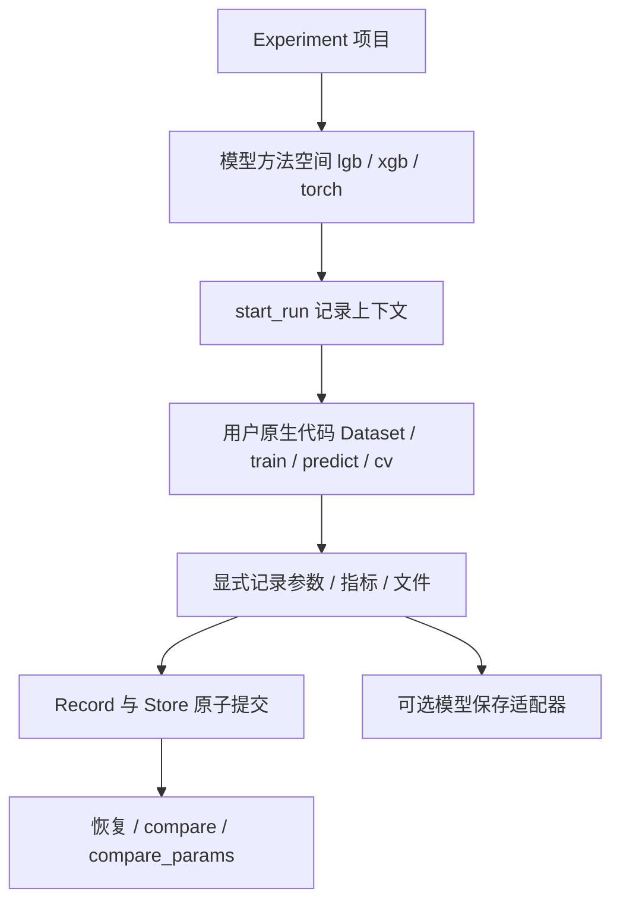

# 原生模型代码与 Experiment 记录（0.9.4）

模型使用原生 API。Experiment 只管理方法空间、Run 生命周期、记录、文件、恢复与比较。
不再提供 LightGBMExecution、Trainer、DatasetBuilder、LightGBMConfig、LightGBMHooks 或任务白名单。



## 源码结构与职责

```text
modeling/experiment/
├── initialization/      创建方法空间；不要求安装训练后端
├── experiment.py       项目查询与 start_run 入口
├── method.py           方法空间的同一套入口
├── record/
│   ├── configuration.py 配置快照、来源与 YAML 产物
│   ├── session.py      活跃 Run 上下文与快照记录
│   ├── run.py          完成/失败结果，校验 artifact
│   ├── store.py        编号、状态、原子提交
│   ├── artifact.py     文件路径与校验和
│   └── comparison.py   DataFrame 比较与参数差异
└── adapters/
    ├── lightgbm.py     原生 Booster 保存/读取；不训练
    ├── _lightgbm_compat.py 可选旧版本依赖桥接
    ├── yaml.py         可选普通 YAML 读取
    └── hydra.py        可选模型无关配置组合
```

不再保留一个只调用用户代码的通用 Executor，也不让初始化绑定训练工厂。
Plan 公共 API 本轮不调整。没有新建 BaseTrainer 或统一模型训练接口。

## 初始化、YAML 与 Hydra

首次创建 LightGBM 空间必须明确 objective 和 metric：

```python
space = Experiment(root="./experiments").initialize(
    method="lgb", objective="binary", metric=["auc", "binary_logloss"]
)
```

生成 `lgb/configs/baseline.yaml`：`params` 包含目标、指标、树结构、学习率、采样、正则、
随机种子和 CPU 参数；`train` 包含轮数、early_stopping 和 log_evaluation 设置。
起步参数可编辑，不保证适合所有数据。metric 接受非空字符串或字符串列表；
禁用内置指标时显式使用字符串 `"None"`，不是 YAML null。
已有空间使用 `open_method("lgb")`；无参数重复 initialize 保留文件。
已有 baseline 时再次传 objective/metric 会报错，避免以为改写成功。

```python
from phl_risk.modeling.experiment.adapters.hydra import compose_config

composed = compose_config(
    config_dir=space.config_dir,
    config_name="baseline",
    overrides=["params.max_depth=3", "params.learning_rate=0.03",
               "params.metric=[auc,binary_logloss]", "train.num_boost_round=300"],
)
cfg = composed.config
```

Hydra 可接受外部传来的 overrides；支持原生 defaults/配置组/插值，不接管训练或输出目录。
模型参数放在 params；训练轮数与 callback 配置放在 train，避免同名/别名的重复覆盖。
配置是用户拥有的普通数据，框架不限制为二分类。

## 基础配置与独立派生配置

baseline.yaml 是公共起点，compose_config 每次读取它生成一套完整参数，不写回源文件。
Hydra 的 overrides 只是派生新配置时使用的原生语法，不是修改 baseline。

```python
baseline_cfg = compose_config(config_dir=space.config_dir, config_name="baseline")
depth3_cfg = compose_config(config_dir=space.config_dir, config_name="baseline",
                            overrides=["params.max_depth=3"])
depth3_lr_cfg = compose_config(config_dir=space.config_dir, config_name="baseline",
                               overrides=["params.max_depth=3", "params.learning_rate=0.03"])
configuration_sets = {"baseline": baseline_cfg, "depth3": depth3_cfg, "depth3_lr": depth3_lr_cfg}
selected_config = configuration_sets["depth3_lr"]
# with space.start_run(config=selected_config) as run: ... 原生训练 ...
```

三套配置各自拥有完整的独立字典。不要用 `other = baseline_cfg` 代替派生，那只是 Python 引用。
同一配置可以执行多次；配置表示方案，Run 表示一次实际执行。需要修改时先准备新配置，再开始 Run。

长期复用的方案可以另存：

```python
saved_path = depth3_lr_cfg.save(space.config_dir / "depth3_lr.yaml")
```

save 原子写入完整 YAML 并拒绝覆盖已有文件。再次执行时可读取已保存的方案，或使用新文件名。
保存的是解析后的参数快照，不含 Hydra defaults 或历史 overrides；后续 baseline 变化不影响它。
Run 若直接接收原 ComposedConfig，仍会记录其派生来源和 overrides。
包含 callable 时只导出身份/源码摘要，读回后需显式绑定真实函数。

## 原生训练与一次配置记录

```python
import lightgbm as lgb
from phl_risk.modeling.experiment.adapters.lightgbm import record_lightgbm

with space.start_run(name="baseline", config=composed,
                     metadata={"data_version": "v1"},
                     comparison_partitions=["train", "valid"]) as run:
    history = {}
    model = lgb.train(cfg["params"], train_set,
                      num_boost_round=cfg["train"]["num_boost_round"],
                      valid_sets=[train_set, valid_set], valid_names=["train", "valid"],
                      callbacks=[
                          lgb.record_evaluation(history),
                          lgb.early_stopping(**cfg["train"]["early_stopping"]),
                          lgb.log_evaluation(**cfg["train"]["log_evaluation"]),
                      ])
    iteration = model.best_iteration or model.current_iteration()
    # 用相同 iteration、正确的预测变换和样本权重计算 metrics。
    run.log_metrics(metrics)
    run.log_json("eval_history", history)
    record_lightgbm(run, model, num_iteration=iteration)
```

`start_run(config=...)` 支持 ComposedConfig、普通 Mapping、YAML 文件路径。
自动保存最终配置、overrides、可用的原始入口 YAML；无需 log_params。
选择 YAML 路径时，可用 `read_yaml_config(path)` 读取后传给原生训练；若改动了读出的字典，
则记录修改后的字典，而不是旧文件路径。配置在 start_run 调用时快照，后续修改不改变记录。
`config=` 和 `params=` 不能同时使用；config 模式下禁止 log_params，避免 config.yaml 与 run.json 不一致。
原来的 `params=` + `log_params` 仍可用于纯 Python 实验。

指标是运行结果，不来自 YAML：保留一次 `log_metrics` 提交，框架不替用户决定计算口径。
文件在上下文正常退出时提交；失败时 run.json 仍保留配置快照与错误。

## Callback 直接使用原生接口

YAML 的 early_stopping/log_evaluation 块只包含对应原生函数的参数，可通过 `**` 直接展开。
无需 controls/es/logging 别名、enabled 判断、callbacks 列表拼装或工厂。
是否使用某个 callback，由传给 lgb.train 的 callbacks 列表明确决定；不使用就不传。
原生日志 period=0 表示静默。自定义 callback 直接放入列表。
配置记录不自动追踪 Python 控制流；源代码版本仍需保留。

旧配置迁移：删除 train.early_stopping.enabled 和 train.log_evaluation.enabled。
原来 enabled=false 的场景，应在原生代码中移除对应 callback，并可移除不再使用的配置块。
已有用户 baseline 不自动修改；本次示例目录已按授权重建。

## 自定义 objective 函数

```python
# custom_loss 是实际函数，不是函数名字字符串。
space = Experiment(root="./custom_experiments").initialize(
    method="lgb", objective=custom_loss, metric="None"
)
composed = compose_config(config_dir=space.config_dir, config_name="baseline",
                          overrides=["params.learning_rate=0.02"])
composed.config["params"]["objective"] = custom_loss
# 然后 start_run(config=composed)，lgb.train(composed.config["params"], ...)。
```

初始化 YAML 只保存 callable 身份及可获得的源码摘要，不能执行或恢复函数。
从 YAML 读回后显式绑定实际函数；不会自动 import/eval，也不会将函数降级为字符串传入 LightGBM。
自定义 feval、学习率调度、其他 callbacks 同样保持原生 Python；可在记录前放入配置以保存身份信息。
闭包、外部状态和源码仍需自行版本管理。objective 可通过新 YAML/Hydra/Python 更换，
初始化只是创建起步文件，并不锁死方法空间的任务。

## Run 生命周期与记录方法

- 进入上下文：分配唯一目录、记录 running 与上海时间。
- `log_input`：数据 schema/特征/角色/样本数等描述；不检查模型任务，不保存原始 DataFrame。
- `log_metrics`：partition → metric → 有限数值；不计算分数，不解释指标方向。
- `log_result`：其他明确结果，如训练耗时、轮数或分析摘要。
- `log_json` / `log_file` / `log_artifact`：保存 JSON、现有文件或由 serializer 写出的文件。
- 正常退出：可靠落盘后提交 completed。异常与 KeyboardInterrupt 记录 failed 并原样抛出。
- 强杀或系统断电可能留下 running，不能假定是成功或自动回收其编号。

文件在 log 时生成快照，避免源文件或模型之后变化；提交前使用内部 .pending，结束时清理。
已完成的 Run 不可改写。已在外部训练好的模型也可用相同上下文登记；metadata 应标记 posthoc。
recording_seconds 只表示上下文耗时，不能保证是纯训练耗时。

## 模型保存是小型可选适配

`record_lightgbm(run, booster, num_iteration=..., importance=True)` 保存原生 model.txt，
记录特征名、明确保存轮数、native best_iteration、Booster params，并可选导出 gain/split importance。
调用时立即保存快照；不会替你选轮数、预测、算 AUC 或限制 objective/callback/device。

`load_lightgbm(run)` 校验文件后返回原生 Booster；也可直接用
`lgb.Booster(model_file=str(run.artifact_path("model")))`。自定义 objective 的预测变换不自动恢复。
LightGBM 4.0–4.5 在仓库现代依赖上可显式调用 `enable_lightgbm_compatibility()`；
这是旧依赖接口桥接，不是训练封装。较新 4.x 不需要修改原生训练接口。

其他模型可以直接使用 `log_artifact`：

```python
space = exp.initialize(method="torch", family="deep")
with space.start_run(params=actual_params) as run:
    # 原生训练代码……
    run.log_artifact("checkpoint", "checkpoint.pt",
                     lambda path: torch.save(checkpoint, path), format="pytorch")
```

模型、optimizer、scheduler 的 checkpoint 内容由用户决定。创建方法空间不意味着实现/测试了该后端。

## 目录、比较与恢复

```text
experiments/
├── experiment.json
├── lgb/
│   ├── method.json
│   ├── configs/baseline.yaml
│   ├── reports/
│   ├── sequence.json / .sequence.lock
│   └── runs/lgb_run_01_YYYY_MM_DD_HHMMSS/
│       ├── run.json
│       ├── config.yaml             config= 时保存最终配置
│       ├── overrides.yaml          config= 时保存；非 Hydra 为空列表
│       ├── config.source.yaml      YAML 路径 / Hydra 入口文件
│       ├── eval_history.json       显式记录时存在
│       ├── model.txt               模型保存适配器生成
│       └── feature_importance.csv  可选
└── xgb/                            可独立初始化
```

Run 文件不必固定：CV 可只有 history 与指标。run.json 是事实权威来源；config= 同时保存便于阅读的 YAML。
Hydra 引用的配置组不逐一复制，但最终 resolved 值完整保存。复现仍需数据、代码和依赖版本。
目录编号由锁与持久计数器分配；失败不复用；Asia/Shanghai 时间。
初始化不覆盖用户 YAML；open_method 只打开已有空间。

```python
space = Experiment(root="./experiments").open_method("lgb")
run = space.get_run("lgb_run_01")
frame = space.compare(runs=["lgb_run_01", "lgb_run_02"],
                      metrics=["auc"], partitions=["valid"], params=["max_depth"])
difference = space.compare_params("lgb_run_01", "lgb_run_02")
```

比较保持 run → name → created_at → objective → metric → 可选 feval → 指标 → params(dict)。指定 comparison_partitions 可隐藏 test/OOT；
未指定时使用已记录指标分区，不隐式推断哪一组是验证集。跨 target、数据版本、权重口径的分数不能直接选优。
框架不推荐最佳模型，不自动计算未记录的指标。

## 迁移与范围

0.9 新建 lgb 空间须明确 objective/metric；旧 baseline 不自动升级，旧 Run 不改写。
0.8 删除旧执行 API 和 RFE helper；RFE 直接使用 sklearn，候选再用原生 train 训练。
普通 dict/YAML/Hydra 不再经过模型配置校验；Hydra adapter 更名为 compose_config。
公共 Record schema 仍为 3；旧同 schema 的事实与原生模型仍可按记录读取，不修改历史 artifact。
记录框架能容纳原生分类、回归、ranking、CV 等，不代表替用户验证这些任务的建模方法。
GPU/CUDA 自由使用原生参数，但本机验收只涵盖 CPU，未执行 GPU 分支。

见 [完整 Guide](../examples/modeling/lightgbm_experiment_complete_guide.ipynb) 与
[验收结果](lightgbm_experiment_review.md)。

## 比较表中的训练目标与监控名称

compare 默认在时间后展示 objective 和 metric，所选成功 Run 记录了 feval 时再增加 feval 列。
自定义函数只显示短名称，完整身份和源码摘要保留在 Run 与 compare_params 中；同名函数需要查看完整记录。
metric 的字符串或列表保持原样，"None" 表示用户配置的禁用值，不等于缺失。缺失或无法展示的值为“未记录”。
这些名称来自配置快照，不是训练后分数；不会从 valid_auc 推断目标，也不读取 metadata 中的同名字段。
支持 params.objective/metric、旧 model.params 及平铺参数；feval 支持 train.feval 或平铺记录。
不同任务/数据口径的结果可用于检查记录，但不应直接排序选优。compare 参数 metrics= 仍指要展示的数值指标名称。
